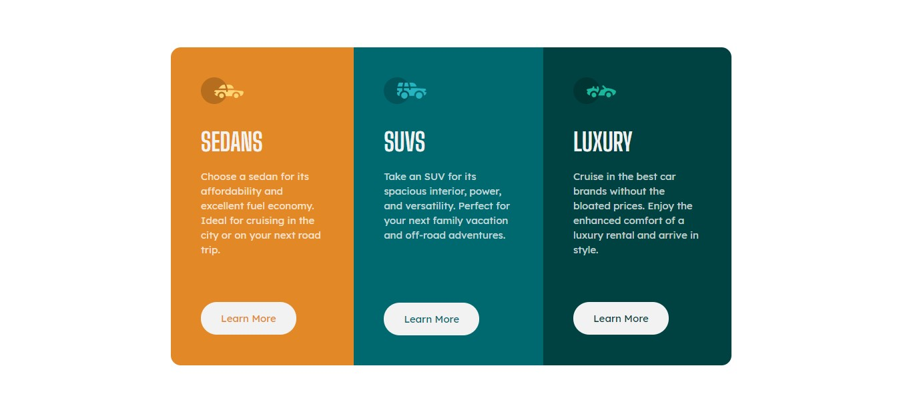

# Frontend Mentor - 3-column preview card component solution

This is a solution to the [3-column preview card component challenge on Frontend Mentor](https://www.frontendmentor.io/challenges/3column-preview-card-component-pH92eAR2-). Frontend Mentor challenges help you improve your coding skills by building realistic projects. 

## Table of contents

- [Overview](#overview)
  - [The challenge](#the-challenge)
  - [Screenshot](#screenshot)
  - [Links](#links)
- [My process](#my-process)
  - [Built with](#built-with)
  - [What I learned](#what-i-learned)
  - [Continued development](#continued-development)
  - [Useful resources](#useful-resources)
- [Author](#author)
- [Acknowledgments](#acknowledgments)


## Overview

### The challenge

Users should be able to:

- View the optimal layout depending on their device's screen size
- See hover states for interactive elements

### Screenshot




### Links

- Solution URL: [Add solution URL here](https://your-solution-url.com)
- Live Site URL: [Add live site URL here](https://your-live-site-url.com)

## My process

Since all the information was the same layout, my focus was to get one perfect then copy the codes to the other 2 cards. I started with Sedans. Once I felt like it was accurate, I copied the same code to suvs and luxury. All I hade to do was change the color. Everything else was exacly the same in terms of format. Same stratergy went for desktop and mobile.

### Built with

- Semantic HTML5 markup
- CSS custom properties
- Flexbox
- Mobile-first workflow
- Sass


### What I learned

Flex when it came to the desktop version really made things easy for me. With minor adjustments, everything was contained the way I wanted. It was only a matter of moving the whole thing to the center. 

```scss
```.container {
        display: flex;
        flex-direction: row;
        flex: wrap;
        max-width: 840px;
        margin: 75px 260px 0;
        
        

    }
```


### Continued development

Even though I managed to center the elements on the desktop version, I'm curious about a better way I could have done it. I tried using jusify-content, but I probably should have also used alighn-items.


### Useful resources

- 

## Author

- Website - [Add your name here](https://www.your-site.com)
- Frontend Mentor - [@shannellassem](https://www.frontendmentor.io/profile/shannellassem)


